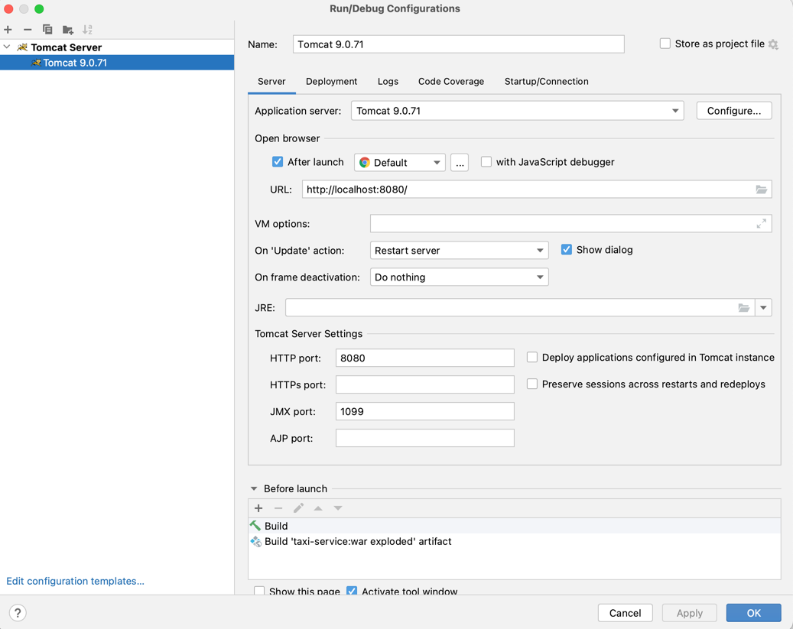

# 🚕 taxi-service 🚕
Here is my first app for a part of a big taxi application.

### In this app you can:
- create new driver
- login to the app
- create new car's manufacturer
- create new car with adding manufacturer to it
- add driver to the car
- get all cars/drivers/manufacturers that you have created
- get all cars for currently logged Driver

### Project structure
**My project has Model-level, Dao-level, Service-level, Controllers, Filter.**
- In Model-level I have classes which describes objects.
- In Dao-level logic how I access to DB.
- In Service-level there are CRUD methods and some specific methods.
- In Controller-package I have logic how we can get app on web-site.
- Filter is responsible for the permission for logged Driver to add data to DB.

### Project technologies
- Java: Java Core, Java 8, OOP, Collections, JDBC;
- Database: MySQL;
- Tools: Maven, IntelliJ IDEA;

### How to start this app?
For start up the application fork this project.

Install IntelliJ IDEA and Tomcat version 9.0.71, MySQL Workbench.

In util package, in ConnectionUtil.Class you have to fill your URL to local host, name of localhost and password, JDBC_DRIVER.

To get the actual parameters of the database tables, run script from the resources/init_db.sql file in the Workbench.

After you have installed tomcat you should edit configurations in Idea. Please, add new configuration: TomcatServer -> Local.
In application server choose Tomcat that you have installed. Fill URL with http://localhost:8080/, HTTP port 8080.
In deployment select taxi-service:war exploded. In application context leave one slash "/". Apply changes.

Now you can run tomcat.

To create new Driver, please, link [here](http://localhost:8080/login).

After you have created new driver you can log in app [here](http://localhost:8080/login).
